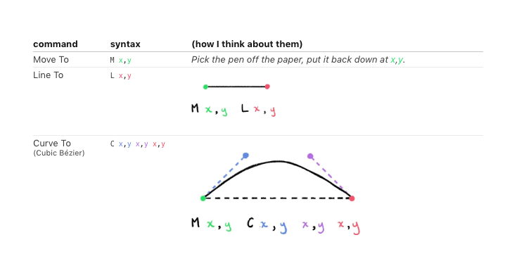
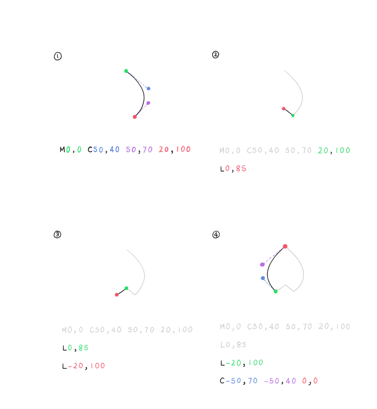

## The SVG Tag
- Not unlike `<canvas>` you basically have to make a main viewport element

    ```html
    <svg width=800 height=600>
    <!-- the actual visible SVG elements here -->
    </svg>
    ```
- apparently you can also specify a coordinate grid for the element, but it seems like h/w work just fine

- The coordinates are (x,y) but the y is reversed
    ```plaintext
    0,0                        0,100
    ------------------------------
    |                            |
    |                            |
    |                            |
    |                            |
    |                            |
    |                            |
    |                            |
    ------------------------------
    0,100                     100,100
    ```

- This blog covers it in a lot of depth https://www.sarasoueidan.com/blog/svg-coordinate-systems/ like viewbox
## Basic SVG Tags
- Here are some of the standard go-tos

| tag | attributes | optional attributes | Notes |
| --- | ---------- | -------------------- | --- |
| `<rect/>` | width, height | x, y (default to (0,0) | square
| `<circle/>` | r | cx, cy | Unlike the square, the cx, cy refer to the exact center of the circle, not the top left hand corner
| `<line/>` | x1,x2,y1,y2 | stroke, stroke-width | A straight line tool
| `<path/>` | d | stroke, stroke-width | A freeform pen tool essentially (the d propert short for "define" is the actual path)
| `<text/>` | x, y, | text-anchor, dy | Here the x, y default to (0,0) but refer to the lower left hand corner, which means the default it out of the viewport. The text anchor is like text-align

- All the shapes can have a `fill` attribute that takes a CSS color. They can also `stroke`, which is a color, and `stroke-width` which just takes a number. However, if the attributes are likely to change, use CSS instead of inline
- If you want ot know more, the W3 guide has pretty much everything https://www.w3schools.com/graphics/svg_inhtml.asp


## Path
The path tool lets you make incredible shapes with essentially only 3 commands



```html
    <path
        d='M0,0 C50,40 50,70 20,100 L0,85 L-20,100 C-50,70 -50,40 0,0'
        fill='none'
        stroke='#000'
        stroke-width=2 transform='translate(500,100)'
    />
```
the curve handles are absolute coordinates on the grid, not moves from the positions.

That transform is because in the tutorial she thinks it's simpler to start at 0 for coordinates, but then translate for actual placement. This is common

In reality, you'll likely just import an SVG.
## Importing an SVG
- in XD, design the asset on a small canvas to get it pixel perrfect. Put your elements into a group folder. The names are what will be used as IDs in your HTML. Then select them all and export (don't include the art board). Then save as .svg, and then open with vscode. Copy out the svg element into your code.